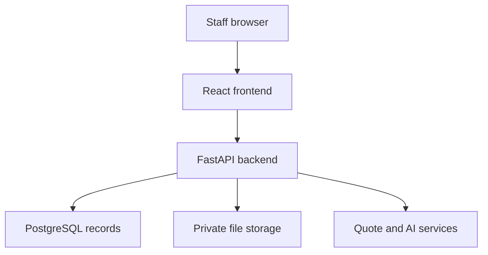
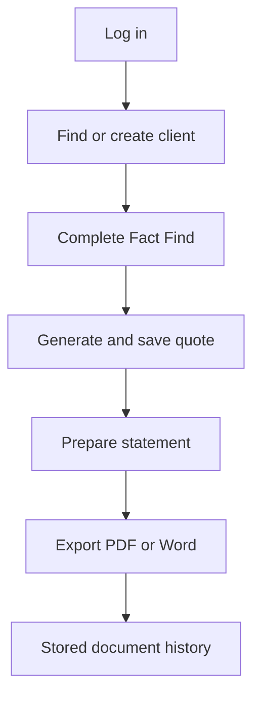
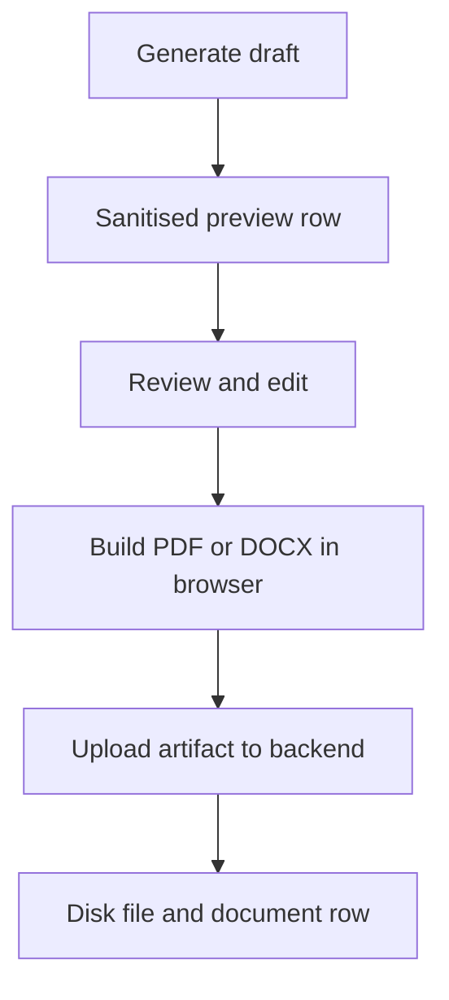

# Omega Document Creator - Page, Save and Layer Flow

**Code reviewed:** `security-fixes-2`, commit `80ab0d6`  
**Purpose:** Describe the current application flow, what each page does, what happens when users save or generate content, and how the frontend, API, database and file-storage layers fit together.

> This describes the application as currently implemented. Items marked **Current gap** are behaviours that should be corrected or clarified before production use.

## 1. Application at a glance

The browser displays the forms and temporarily holds the fields being edited. The backend is the security boundary and validates the signed-in user, client access and request origin. PostgreSQL is the source of truth for users, sessions, clients, workflow data, file metadata, generated-document history, audits and backups. PDF, Word and uploaded file bytes are stored on the office server's disk; PostgreSQL stores their relative paths.

## 2. Main user journey

A normal Income Protection journey is:

1. Sign in.
2. Select an existing client or create a new client.
3. Complete the Fact Find and, when relevant, the Fact Find Update.
4. Generate one or more quotes and save the required quote snapshots.
5. Select a quote and prepare the Statement of Suitability.
6. Generate the document draft, review or edit the preview, then export it to PDF or Word.
7. The exported file appears in Generated Documents and is stored in the client's server folder.

The Pensions journey uses the same shared workflow engine, but with `Pensions Quote` and `Pensions Statement` document types.

## 3. What "Save" means

| User action | What is saved | Destination | Durable after refresh? |
|---|---|---|---|
| Save Draft on Create/Edit Client | Core identity, contact, address, assignment and dependants | `clients` and `dependants` tables | Yes |
| Save Fact Find / Update / Statement | Core client fields, then the full workflow draft | Client tables plus workflow tables and workflow JSON metadata | Yes, if both API calls succeed |
| Workflow autosave | Same data as the manual workflow save | Same destinations as above | Yes, if both API calls succeed |
| Save Quote | A named copy of quote inputs, results and generated/edited content | Saved inside the persisted workflow metadata | Yes, if workflow persistence succeeds |
| Generate Draft | Generated HTML/sections and document-history metadata | Browser workflow state plus a `documents` database row | Preview/history yes; no downloadable binary yet |
| Export PDF or Word | Final PDF/DOCX bytes plus document metadata | Server disk plus `documents` table | Yes |
| Upload File | Original file bytes plus metadata | Server disk plus `files` table | Yes |
| Save Documents on Client Profile | No document changes | Refreshes the lists only | Not applicable |
| Save Settings | Settings JSON file | `admin-settings.json` | File persists, but the running app does not currently consume it |

## 4. Shared layer responsibilities

| Layer | Responsibility |
|---|---|
| React pages/components | Display forms, hold in-progress input, show validation and save status, create browser PDF/DOCX exports |
| Client data context | Cache accessible clients in memory, translate frontend field names to API payloads, refresh client details |
| API client modules | Send authenticated HTTP requests for clients, workflows, files, documents and administration |
| FastAPI routes | Validate the session, CSRF origin and client access; validate payloads; coordinate repositories and storage; write audit entries |
| Repositories | Read, create and update SQLAlchemy database models |
| PostgreSQL | Authoritative structured records and workflow metadata |
| File-storage service | Stream uploaded/exported files into safe client folders and prevent path traversal |
| External integrations | Produce Income Protection or Pension quotes; optionally produce AI-generated document copy |

## 5. Authentication and access flow

### Login page - `/login`

**Purpose:** Authenticate an individual staff member.

**Flow:**

1. The user enters email and password and selects **Sign In**.
2. The frontend sends `POST /auth/login`.
3. The backend applies the login rate limit, finds the PostgreSQL user, verifies the password hash and checks that the account is active.
4. A server-side session row is created in PostgreSQL.
5. The session identifier is placed in the encrypted/signed session cookie.
6. Login success or failure is written to the audit log.
7. The frontend mirrors basic user details in `sessionStorage` for display only and redirects to `/income-protection`.

On later page loads, `GET /auth/me` validates the persisted session, checks the user remains active and extends the session expiry. The browser copy does not grant access by itself.

**Access model:**

- `staff`: clients they created or are assigned to.
- `manager`: access to all client records, but not the Admin or Settings pages.
- `admin`: access to all client records plus Admin and Settings.
- Workflow, file and document routes inherit the same client-access decision.

**Current gap:** `force_password_change` is stored and displayed but is not enforced. There is no staff password-change page.

## 6. Navigation shell

The top navigation provides Clients, Fact Find, Income Protection and Files/Docs. Settings and Admin appear only for administrators. The header search redirects to `/clients?search=...`; the search itself is then performed in the browser against the already loaded accessible client list.

The Pensions route exists at `/pensions`, but it is not currently included in the top navigation.

Signing out sends `POST /auth/logout`, removes the exact PostgreSQL session row, clears the cookie and clears the browser's session mirror.

## 7. Clients page - `/clients`

**Purpose:** List the clients the signed-in user is permitted to access.

**Page load:**

1. The shared client context requests `GET /clients`.
2. The backend filters clients using the user's role, creator identity and assignment.
3. The frontend then requests each accessible client's detail record.
4. The results are converted into the shared frontend client model and held in memory.

The page shows total, active and draft counts. Search, highlighting and sorting are browser-side operations and do not alter the database.

**Actions:**

- **Create Client** opens `/clients/new`.
- Selecting a row opens `/clients/{clientReference}`.
- The page contains no save operation.

## 8. Create/Edit Client page - `/clients/new` and `/clients/{ref}/edit`

**Purpose:** Create or update the core client record used by every workflow.

**Main information:** name, title, email, phone numbers, date of birth, marital status, home address, partner information, assignee and general notes.

**Validation:** first name, surname and valid email are required. A supplied mobile number must contain at least ten digits.

### Creating a client

1. The form begins with a genuinely empty client object and a temporary display reference.
2. After one second of inactivity, a valid non-empty form is autosaved.
3. The client context sends `POST /clients`.
4. The backend authenticates the user and allocates the authoritative `CLI-YYYY-NNNN` reference using the database counter.
5. The client repository writes the `clients` row, creator/assignee links and any dependant rows.
6. The backend writes a `client_created` audit record and commits the transaction.
7. The returned authoritative client replaces the temporary browser draft.

### Editing a client

The same one-second autosave sends `PATCH /clients/{ref}`. The repository updates the client fields, assignment and `updated_by`. If dependants are included, the old dependant rows are replaced with the submitted list. The audit log records the names of the updated fields.

### Manual Save Draft

The button runs the same create/update operation. On success, the user is sent to the Client Profile page.

**Important behaviour:** Cancel does not undo data that has already been autosaved.

**Current gaps:** save errors are not handled inside this page's save function, and autosave can overlap a manual submission. Either can leave the UI stuck or produce confusing results during a network failure.

## 9. Client Profile page - `/clients/{ref}`

**Purpose:** Show the core client record, document history, files and dependants in one place.

**Page load:**

- Client details come from the shared PostgreSQL-backed client context.
- `GET /clients/{ref}/documents` loads generated-document history.
- `GET /clients/{ref}/files` loads uploaded files.

**Actions and results:**

| Action | Result |
|---|---|
| Edit Client | Opens the core client form |
| Open Income Protection | Stores the selected reference as a browser rehydration hint, then redirects to `/income-protection` |
| Open document | Displays the stored, sanitised preview in a sandboxed iframe |
| Download document/file | Backend verifies access and streams the stored artifact |
| Upload file | Writes the file to disk and its metadata to PostgreSQL |
| Delete file | Deletes the database row, commits, then removes the disk artifact |
| Archive Client | Admin-only backend operation; sets status and `archived_at`, preserving associated data |
| Save Documents | Only refreshes the file and document lists; it does not save changes |

**Current gaps:**

- **Save Dependant** currently changes page-local React state and shows success but does not call the client API. The dependant is lost on refresh.
- Archive Client is displayed to all signed-in users even though the backend correctly permits administrators only.
- Save Documents should be renamed **Refresh Documents**.

## 10. Shared workflow engine

Fact Find, Income Protection, Pensions and Files/Docs still run through the same `IncomeProtectionPage` workflow engine. That shared engine now delegates parts of the UI into support modules for document sections, files, generated documents and layout, so it is more accurate to describe it as one orchestration surface with extracted subcomponents rather than one entirely self-contained page file.

### Selecting a client

1. The last selected reference is read from `localStorage` as a convenience hint.
2. The selected core client comes from the shared client context.
3. `GET /clients/{ref}/workflow` loads the saved workflow fields.
4. Core client details and workflow fields are merged into one working draft.
5. Files and generated-document history are loaded separately when their tabs are used.

Only the selected reference is intended to remain in `localStorage`; it is not the authoritative client record.

### Editing and autosave

1. A field change updates the page's React draft and marks it **Unsaved changes**.
2. After 900 ms without another change, the page runs `persistDraft()`.
3. It first saves the core client subset through `POST/PATCH /clients`.
4. It then sends the wider draft to `PUT /clients/{ref}/workflow`.
5. The workflow repository distributes known fields across `fact_find`, `employment_details`, `protection_details`, `life_serious_illness_details`, `terms_of_business` and `statement_of_suitability`.
6. Saved quotes, generated-draft state and other unmapped workflow fields are normalised and stored in JSON metadata attached to the statement record.
7. A `workflow_saved` audit record is committed.
8. The UI becomes **All changes saved** and records the save time.

The page also tries to flush a dirty draft when the page becomes hidden or is closed. Switching client or tab while dirty prompts the user.

**Important limitation:** core-client save and workflow save are two independent HTTP requests and therefore two independent database transactions. If the first succeeds and the second fails, the client record is updated but the workflow is only partly saved. A future design should provide one atomic workflow-save endpoint.

**Current gap:** when there are no accessible clients, the workflow component can display data from the seeded test-client fallback. Production should show a clear "Create or select a client" empty state instead.

## 11. Fact Find page - `/fact-find`

The page has two workspaces: **Fact Find** and **Fact Find Update**.

### Fact Find

The form is organised into:

- Client Profile.
- Income Protection and employment details.
- Financial Position: assets, liabilities, savings/investments and life/serious-illness cover.
- Pension Arrangements.
- Advice Context and business source.
- Declarations and Consent.
- Authorisation and Sign-off.

The progress map and readiness indicator are calculated in the browser from required fields. Selecting an incomplete item opens the relevant accordion and focuses the missing field.

**Save Fact Find:** runs the shared two-stage client/workflow save described above.

**Generate Fact Find:**

1. Required fields are checked.
2. Missing fields block generation and the first missing field is opened.
3. The current draft is saved.
4. `POST /documents/generate` is called with client reference, document type, template and workflow snapshot.
5. The backend verifies client access and builds a prompt from an allowlist of approved fields.
6. If Gemini is configured and succeeds, it returns structured sections. Otherwise the backend uses the deterministic seeded document builder.
7. HTML is sanitised and a versioned `documents` row is written with its preview snapshot.
8. The frontend composes the generated sections into the editable document workspace.

Generating creates a preview/history record, not a PDF or Word file. Export is a later step.

### Fact Find Update

This captures future review information in three groups:

- Additional Relevant Information.
- Client Declarations, Data Protection and PEP Confirmation.
- Signatures.

Save, validation, generation, editing and export use the same layer sequence as the main Fact Find, but use the `Fact Find Update` document type.

## 12. Income Protection page - `/income-protection`

The page contains **Quote** and **Statement of Suitability**.

### Quote workspace

The user supplies the required quote inputs, including annual cover, cover-to age, occupational class, deferred period, smoker status and indexation. Client identity and date-of-birth information come from the shared Fact Find/client draft.

**Generate Quote:**

1. The browser validates the required quote and shared client fields.
2. `POST /documents/statement-quote` sends the quote workflow snapshot to the backend.
3. The backend verifies client access.
4. The PHI integration builds and sends the XML request to the configured quotation service.
5. Normalised provider, product and premium results return to the browser.
6. Results are placed in the editable Quote draft.
7. Workflow autosave subsequently persists that draft.

If a previously submitted quote's inputs change and all fields remain complete, the page automatically requests an updated quote after a short delay.

**Save Quote:**

1. At least one generated quote result is required.
2. The user-supplied name, or an automatically constructed client/provider/scenario/time name, identifies the snapshot.
3. Inputs, provider results, generated sections, edited HTML and template choice are copied into a `SavedQuoteSnapshot`.
4. The snapshot is added to `savedQuotes` and persisted through the workflow endpoint.

Loading a saved quote restores its inputs, results and editable output. Deleting removes that snapshot and saves the updated workflow list.

**Current gap:** save, load and delete can still show a success toast when workflow persistence failed. The status text may report failure, but the toast is misleading.

### Statement of Suitability workspace

The form contains:

- Statement basics.
- Recommendation basics.
- Cover summary.
- A selected quote/policy from the quote results.
- Generated Output.

**Save Statement:** persists the current client and workflow draft.

**Generate Statement:** validates the required Fact Find, quote-selection and statement fields, saves the draft, calls `POST /documents/generate`, stores the sanitised versioned preview in document history, and loads it into the editor.

## 13. Pensions page - `/pensions`

Pensions reuses the same Quote and Statement interface with different document types and quote fields.

### Pensions Quote

The quote snapshot includes age/date of birth, gender, retirement age, spouse's pension, escalation assumptions, growth, inflation, existing fund, target pension and monthly contribution. `POST /documents/statement-quote` routes this snapshot to the configured Pension quotation integration rather than the PHI integration.

Saved pensions quotes are filtered and stored separately by the `Pensions Quote` document type, although they remain inside the same client workflow metadata.

### Pensions Statement

Save, validation, generation, editing and export follow the Statement of Suitability flow but use the `Pensions Statement` document type.

**Current gap:** the route works but is not visible in the main navigation.

## 14. Generated Output and export flow

The generated workspace supports template choice, generation, rich-text editing, PDF export and Word export.

On export:

1. The frontend sanitises the latest edited/generated HTML.
2. It composes the full Omega document shell.
3. It builds the PDF or DOCX blob in the browser.
4. It downloads a copy to the user's computer.
5. It sends the same artifact to `POST /clients/{ref}/documents`.
6. The backend sanitises the preview again, assigns metadata, and streams the artifact into the client's document folder.
7. The relative artifact path is written to the document row and the transaction is committed.
8. The document becomes available in Generated Documents.

This can produce two document-history records: one when a draft is generated and another when its exported artifact is uploaded. The generated row contains the preview; the exported row contains the downloadable file. A cleaner future model would connect the export to the original generated row.

## 15. Files/Docs page - `/files-docs`

### Files tab

The user can select a file, filter the visible list, download files and delete files.

**Upload:**

1. The browser submits multipart form data to `POST /clients/{ref}/files`.
2. The backend verifies client access.
3. The storage service streams the upload in chunks, enforces the configured maximum size and creates a safe unique filename.
4. The file is stored under the client/year/workflow/files path.
5. A `files` row stores the original name, relative path, category, uploader and status.
6. An audit record is written and the database transaction commits.
7. If the database write fails, the just-written disk file is removed.

**Delete:** the database row and audit record commit first; the disk artifact is removed afterwards.

### Generated Documents tab

The list comes from `GET /clients/{ref}/documents`. Users can preview, download, delete or regenerate an individual document. **Download Pack** requests a ZIP containing all stored PDF/DOCX artifacts for the client.

Preview uses sanitised stored HTML inside a sandboxed iframe. Download requires a real artifact path; a preview-only generated row cannot be downloaded until it has been exported.

## 16. Admin page - `/admin`

Only administrators can enter this page. It loads users, audit logs, backup runs, security status, storage reconciliation and scheduler status from PostgreSQL-backed/admin services.

### Users

- Add a database user with staff, manager or admin role.
- Enable or disable an account.
- Reset a password and mark it for forced change.
- View last login and reset-pending status.

**Current gap:** all new/reset passwords default to `Omega123`, password change is not enforced, and existing sessions are not revoked on reset.

### Security

Displays the live environment, application URL, remote-access mode, session timeout, cookie settings, user/session counts and scheduler state.

### Storage Reconciliation

- Preview compares database file/document rows with disk artifacts.
- Execute performs the configured cleanup and records an audit event.

**Current gap:** Execute Cleanup is destructive and has no final confirmation dialog.

### Backups and restore

- Run Backup creates a database dump, files archive, documents archive and manifest, then stores a backup-run row.
- Validate Restore checks the manifest/artifacts and issues a short-lived approval token.
- Dry Run performs non-destructive checks and issues an approval token.
- Execute Restore requires the token and exact confirmation phrase, records the attempt and restores the configured artifacts.

**Current gap:** live database restore runs inside a normal application request while the application is connected to the same database. Restore should be an offline maintenance operation with pre-validation of all artifacts and an application maintenance mode.

### Audit logs

Logs can be filtered by user, action, entity type, client reference and date. They record important authentication, client, workflow, file, document, admin and backup operations.

## 17. Settings page - `/settings`

Only administrators can enter this page.

### Core settings

- Admin email.
- Application URL.
- File-storage path.
- Backup path.
- Local/LAN/remote access mode.
- Session timeout.

The Test Path buttons ask the backend to verify that the selected directory exists and is writable.

### AI settings

The page can enable Gemini, select the supported model, set a server-side API key or clear it. The API key is never returned to the browser.

### Save Settings

The backend writes the values to `admin-settings.json` beside the backup directory and returns a sanitised response.

**Current gap:** the running application reads configuration from `.env`/environment variables through `get_settings()`, not from `admin-settings.json`. Restarting therefore does not apply these saved settings, despite the page message. The page should either update the actual deployment configuration safely or become a read-only configuration/status page.

## 18. Data ownership map

| Data | Authoritative location |
|---|---|
| User accounts and roles | PostgreSQL `users` |
| Active login sessions | PostgreSQL `sessions` plus signed session cookie |
| Core client details and assignment | PostgreSQL `clients` |
| Dependants | PostgreSQL `dependants` |
| Structured workflow fields | Fact Find, employment, protection, life/illness, terms and statement tables |
| Wider workflow fields and saved quotes | Workflow JSON metadata on the statement record |
| Generated preview history | PostgreSQL `documents.preview_html` and related metadata |
| Uploaded files | Server disk; relative paths/metadata in PostgreSQL `files` |
| Exported PDF/DOCX | Server disk; relative paths/metadata in PostgreSQL `documents` |
| Audit history | PostgreSQL `audit_logs` |
| Backup history | PostgreSQL `backup_runs`; backup artifacts on disk |
| Selected client hint | Browser `localStorage`; convenience only |
| Displayed user mirror | Browser `sessionStorage`; convenience only |

## 19. Cross-cutting security flow

Every protected backend action follows the same broad sequence:

1. Validate the signed session cookie against the PostgreSQL session row.
2. Confirm the user still exists and is active.
3. For state-changing requests, validate Origin/Referer against trusted origins.
4. Resolve the client and confirm staff/manager/admin access.
5. Validate and normalise request data.
6. Perform the database and/or storage operation.
7. Write the audit event where supported.
8. Commit the database transaction.
9. Return only application data and safe relative/artifact responses, never raw server paths.

## 20. Recommended flow improvements

Priority improvements arising directly from the current flow are:

1. Add a real password-change and first-login flow; revoke sessions after password reset.
2. Replace the two-request client/workflow save with one atomic backend transaction.
3. Handle and serialise Create/Edit Client autosaves so manual save and autosave cannot overlap.
4. Persist dependants from Client Profile or remove that form until it is connected.
5. Make quote save/load/delete notifications reflect the actual persistence result.
6. Link exported artifacts to the original generated document row rather than creating parallel history entries.
7. Replace the seeded no-client fallback with a production empty state.
8. Add Pensions to navigation when it is ready for normal use.
9. Rename Save Documents to Refresh Documents.
10. Make Settings operational or explicitly read-only.
11. Move restore execution into an offline maintenance procedure.
12. Add final confirmation and a report of exact actions before destructive storage cleanup.

## 21. Unavailable supporting documents

The following files were not available in the workspace and were not used to verify profession-specific copy, templates or generated-document content:

- `Income Protection for Vets.docx`
- `Income Protection for Physiotherapists.docx`
- `Income Protection for General Practitioners.docx`
- `Income Protection for Dentists.docx`
- `Income Protection for HSE Professionals.docx`
- `Income Protection for Medical Consultants.docx`
- `Income Protection for Chartered Surveyors.docx`
- `Income Protection for Pharmacists.docx`
- `Omega - Pension Website Content.docx`
- `Omega - Pensions for GP's Overview.docx`
- `Omega - Pensions for Consultants Overview.docx`
- `Omega - Pensions for Dentists Overview.docx`

OFM Financial Ltd T/A Omega Financial Management, regulated by the Central Bank of Ireland.
